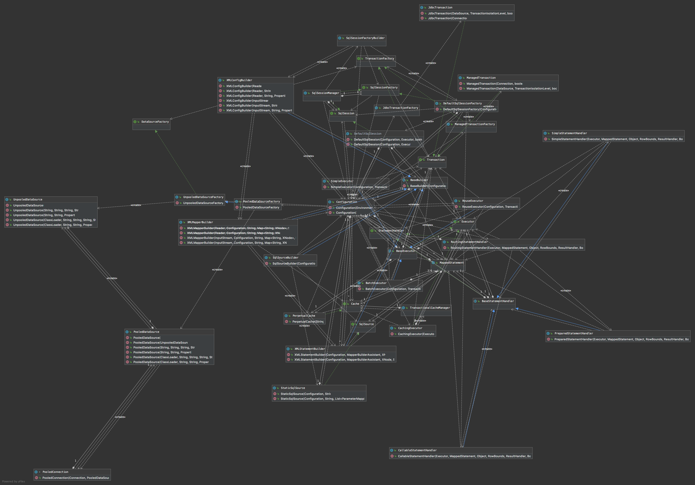

## 类解析

### 解析器
##### XPathParser
解析 mybatis-config.xml 配置文件工具类
- DOM(Document Object Model)解析方式  
- SAX (Simple API for XML)解析方式 推模式 解析部分XML  
- JDK 支持的 StAX (Streaming API for XML)解析方式 拉模式 解析部分XML 

### 反射
##### Reflector
Reflector 是 MyBatis 中反射模块的基础,每个 Reflector 对象都对应一个类,在 Reflector 中缓存了反射操作需要使用的类的元信息，包含原始类、类的构造方法、 写字段、读字段、getter 方法、setter 方法 、方法的返回类型。

##### ReflectorFactory
创建 Reflector 对象，工厂模式接口。

##### Invoker
Invoker 调用者、是对象 getter 或者 setter 方法、get一个字段、set 一个字段，这几种类方法和属性的封装，方便放射对象调用。
##### GetFieldInvoker
类字段 get 方法的封装

##### SetFieldInvoker
类字段 set 方法的封装

##### MethodInvoker
一个类的 getter 和 setter 方法的封装，方便反射调用，这个类的getter 和 setter 方法，进行 属性赋值。

##### ObjectFactory
创建对象使用的工厂接口

##### DefaultObjectFactory
默认创建对象的工厂实现，使用 Java 反射技术

##### PropertyTokenizer
PropertyTokenizer是分词器,编译器，解析这样的 orders[0].items[0].name 表达式，实现了Iterator，具有迭代功能。

##### PropertyNamer
获取类的 getter、setter 方法 对应的属性名称。

##### PropertyCopier
PropertyCopier 一个属性拷贝的工具类，主要处理相同类型的两个对象之间的属性拷贝。

##### MetaClass
MetaClass 是对 Reflector 的封装，是类层次的信息封装。
MetaClass 通过 Reflector 和 PropertyTokenizer 组合使用, 实现了对复杂的属性表达式的解析,并实现了获取指定属性描述信息的功能。
主要实现了 1.检测是否包含这个复杂的属性表达式，2.属性表达式的返回数据类型 3.返回 Reflector 对象的集合信息们。

##### MetaObject
MetaObject 是对象层级的包装，对象的 getter、setter、filed、和他们的数据类型的方法。
MetaObject 是 Mybatis 提供的一个用于方便、优雅访问对象属性的对象，通过它可以简化代码、不需要 try/catch 各种 reflect 异常，同时它支持对 JavaBean、Collection、Map 三种类型对象的操作。
MetaObject 包装了 objectWrapper，从而提供了对 对象属性 的操作。

反射包的大部分类都是为 MetaObject 服务的，这个是对外暴露的对象原信息操作的接口。

服务类包括：Reflector、ReflectorFactory、MetaClass、ObjectFactory 接口和实现、Invoker 接口和实现、ObjectWrapper 接口和实现、Property 属性工具类。

包装关系：MetaObject -> ObjectWrapper -> MetaClass -> Reflector -> 元类的基础信息（filed、getter、setter 方法、读写属性、成员的数据类型、方法的调用）。

##### ObjectWrapper
ObjectWrapper 是对对象的包装的接口，抽象了对象的字段信息、 getter| setter 方法、和上面三个成员的数据类型,它定义了一系列查询对象属性信息的方法,以及更新属性的方法 。

##### BaseWrapper
BaseWrapper 抽象类 定义了集合的相关操作。
BeanWrapper 是原始对象的封装，MapWrapper 是 Map 集合对象的封装。

##### BeanWrapper
BeanWrapper 是对象的信息封装，包括 getter、setter 方法、字段、及(getter、setter 方法、字段)的返回数据类型。

### 类型转换

##### TypeHandler
在通过 PreparedStatement 为 SQL 语句绑定参数时，将 JavaType 转换为 JdbcType，从 ResultSet 中获取数据时会调用此方法,会将数据由 JdbcType 类型转换成 JavaType 类型。

##### StringTypeHandler
java.lang.String 和 数据库类型 varchar 自定义转换类。 

##### TypeHandlerRegistry
在 MyBatis 初始化过程中,会为所有己知的 TypeHandler 创建对象对象，并实现注册到成的TypeHandlerRegistry 中,由 TypeHandlerRegistry 负责管理这些 TypeHandler 对象。

### 日志

##### Log
MyBatis 适配日志接口

##### LogFactory
日志工厂，决定使用哪一个第三方日志，创建记录日志的 Log 对象，mybatis 采用适配器模式，适配了 slf4j，log4j 等多个日志框架。

##### Jdk14LoggingImpl
Jdk14LoggingImpl 实现了 org.apache.ibatis logging.Log 接口，并装饰了 JDK 日志的功能。

### 数据源
##### DataSource
在数据持久层中，数据源是一个非常重要的组件，其性能直接关系到整个数据持久层的性能。MyBatis 提供了自己的数据源实现。

##### DataSourceFactory
DataSourceFactory 是一个接口，数据源工厂类，主要定义了获取DataSource 的规范。
##### UnpooledDataSourceFactory
非连接池数据源工厂，通过构造方法直接返回 UnpooledDataSource 对象，并设置相关连接属性。
##### PooledDataSourceFactory
PooledDataSourceFactory 继承了 UnpooledDataSourceFactory，构造方法直接返回 PooledDataSource 对象。
##### UnpooledDataSource
UnpooledDataSource 是非连接池数据源，主要用来获取 Connection。主要涉及了数据库驱动的注册、连接的参数设置和连接的获取。

#### 数据源连接池
MyBatis 实现了数据源连接池，主要通过 PooledConnection、PoolState、PooledDataSource 实现了连接池功能。连接池主要用来保存活跃连接，还有从连接池中获取连接，还有连接 Connection.close() 方法，不在是关闭连接，而是将连接放入连接池中，供下次连接的获取。通过 JDK 动态代理创建了 Connection 的代理对象，在调用 close() 方法时，通过 invoke 方法实行了拦截，将连接放入了连接池中。

##### PooledConnection
连接池中的一个连接，包含一个连接的代理对象，用来实现调用 close() 方法时，进行拦截，将连接重新放入连接池中。
主要实现了 InvocationHandler 接口，创建了 connection 代理对象，通过 invoke() 方法拦截了 connection.close() 方法，将连接重新放入连接池中。

##### PoolState
PoolState 是线程池的状态，用于管理 PooledConnection 对象状态的组件，通过 idleConnections 和 activeConnections 两个 PooledConnection 集合分别管理空闲状态的连接和活跃状态的连接。

##### PooledDataSource
PooledDataSource 是一个简单的、同步的、线程安全的连接池。
PooledDataSource 中管理的真正的数据库连接对象是由 PooledDataSource 中封装的 UnpooledDataSource 对象创建的，并由 PoolState 管理所有连接的状态，把 UnpooledDataSource 包装成了 PooledDataSource， 从而形成了连接池。

### 事务管理
##### Transaction
Transaction 包装了一个数据连接，处理连接的生命周期:its creation, preparation, commit/rollback and close。

##### JdbcTransaction
- 事务直接使用了JDBC提供的 提交和回滚基础设施.
- 事务依赖于从数据库连接池中重新获取的链接，来管理事务的生命周期.
- 懒加载，直到调用了getConnection()才会从数据库连接池中重新获取 connection.
- 当设置了自动提交，忽略commit和rollback.

##### ManagedTransaction
- 容器管理着的 transaction，自己并不提供事务支持；
- 忽略所有的 commit 和 rollback 请求；
- 默认情况，connection 是否关闭，可以在配置文件中配置； 

### 缓存
##### Cache
- MyBatis 中的缓存是两层结构的，分为一级缓存、二级缓存，但在本质上是相同的，它们使用的都是 Cache 接口的实现。
- Cache 使用了装饰器模式，为 Cache 装饰了多个功能。
- 一级缓存是 PerpetualCache 对象，二级缓存是在 PerpetualCache 基础上装饰了其他功能。

##### PerpetualCache
PerpetualCache 永久的缓存,一级缓存(LocalCache)和二级缓存的默认缓存。内部通过 HashMap 对象进行数据缓存，并重写了 equals 和 hashCode 方法。

##### LruCache
最近最少使用缓存

##### FifoCache
先进先出缓存，使用 LinkedList 来实现先进先出

##### CacheBuilder
mapper 实体二级缓存构造器,在这里对 PerpetualCache 进行了添加了装饰器，装饰了不同的功能。

##### BlockingCache
简单的、低效版本的阻塞缓存个装饰器，阻塞是指只有一个线程取从缓存中查询数据，如果缓存没有，只有一个线程可以从数据库中查询数据。

##### SoftCache & WeakCache

##### ScheduledCache&LoggingCache&Synchronized&CacheSerializedCache

### 插件
插件是一种常见的扩展方式,来扩展或改变框架的原有功能。
Mybatis 插件实际是一种拦截器(Interceptor),使用 JDK 代理动态代理来实现，多个插件，就又设计到了责任链模式。

##### Interceptor
MyBatis 中使用的拦截器都需要实现 Interceptor 接口。 Interceptor 接口是 MyBatis 插件模块核心。

##### Plugin
插件的实现，把拦截器的功能包装进项目里插件容器

##### Invocation
拦截器对象的包装，主要为了调用被拦截对象的真实需要的方法。

### 配置解析
##### BaseBuilder
BaseBuilder 是一个基础抽象类，定义了一些通用方法，有多个具体实现类；成员变量包括：解决数据类型别名的注册器 typeAliasRegistry，及处理 JDBC 类型和 Java 数据类型对应的、类型处理转换器注册中心 typeHandlerRegistry；还有一些简单的工具方法；

##### XMLConfigBuilder
XMLConfigBuilder 是一个读取并解析 mybatis-config.xml 配置的文件的类。

##### XMLMapperBuilder
解析实体 mapper.xml 文件解析器

##### XMLStatementBuilder
XMLStatementBuilder 主要用来解析 <mapper> 下的 <select|insert|update|delete> 节点 sql 语句。

##### SqlSourceBuilder
SqlSourceBuilder 主要完成了两方面的操作， 方面是解析 SQL 语句中的"#{}"占位符中定义的属性，格式类似于#{item_0, javaType=int, jdbcType=NUMERIC,typeHandler=MyTypeHandler}， 另一方面是将 SQL 语句中的"${}"占位符替换成 "?" 占位符。

### 主键生成策略

##### KeyGenerator
KeyGenerator 是用来获取 insert、update 语句 获取数据库主键 id 的。

##### Jdbc3KeyGenerator
Jdbc3KeyGenerator 用于取回数据库 生成的自增 id,对应 mybatis-config.xml 配置文件中的 useGeneratedKeys 全局配置，以及 insert 节点中 useGeneratedKeys 属性。

##### SelectKeyGenerator
对于不支持自动生成自增主键的数据库，例如 Oracle 数据库，用户可以利用 MyBatis 提供 的 SelectkeyGenerator 来生成主键， SelectKeyGenerator 也可以实现类似于 Jdbc3KeyGenerator 提供的、获取数据库自动生成的主键的功能。

### StatementHandler
##### StatementHandler
StatementHandler 依赖 ParameterHandler 和 ResultSetHandler 完成了 Mybatis 的核心功能，它控制着参数绑定、 SQL 语句执行、结果集映射等一系列核心过程。

- Statement 是 java.sql 包中的一个类，主要用于 sql 语句的执行和 sql 执行返回结果的处理。
- StatementHandler 是对 Statement 的一个封装，提供了 Statement 的所有功能，使 Mybatis 使用 Statement 对象更方便、快捷。
- 提供了 创建 Statement 对象，绑定执行的实参，批量执行 Sql语句，执行 select、update、delete、insert 语句功能，还有将结果集映射为成结果对象。

##### RoutingStatementHandler
RoutingStatementHandler 会根据 MappedStatement 指定的 statementType 宇段，创建对应的 StatementHandler 接口实现。

##### BaseStatementHandler
BaseStatementHandler 是 StatementHandler 的一个抽象类定义了各个 StatementHandler 接口集体实现的公共成员。

##### SimpleStatementHandler
SimpleStatementHandler 继承了 BaseStatementHandler 抽象类。它底层使用 java.sql.Statement 对象来完成数据库的相关操作。所以 SQL 语句中不能存在占位符,相应的，SimpleStatementHandler.parameterize() 方法是空实现。

##### PreparedStatementHandler
PreparedStatementHandler 底层依赖于 java.sql.PreparedStatement 象来完成数据库的相关操。

##### CallableStatementHandler
CallableStatementHndler 底层依赖于 java.sql.CallableStatement 调用存储过程，其中 parameterize()方法也会调用 ParameterHandler.setParameters()方法完 SQL 语句参数绑定，并指定输出参数的索引位置和 JDBC 类型。

### SQL执行器
##### Executor
Executor 是 Mybatis Sql 执行器，是核心接口之一，定义了数据库操作的基本方法。 SqlSession 接口的功能都是基于 Executor 接口实现的。

##### BaseExecutor
BaseExecutor 是一个实现了 Executor 接口的抽象类，它实现了 Executor 接口的大部分方法，其中就使用了模板方法模式。

BaseExecutor 主要提供了缓存管理和事务管理的基本功能，继承 BaseExecutor 子类只要实现四个基本方法来完成数据库的相关操作即可，这四个方法分别 doUpdate()方法、 doQuery() 方法、 doQueryCursor() 方法、 doFlushStatement() 方法，其余的功能在 BaseExecutor 实现。

##### SimpleExecutor
SimpleExecutor 继承了 BaseExecutor 抽象类 它是最简单的 Executor 接口实现。Executor 使用了模板方法模式，一级缓存等固定不变的操作都封装到了 BaseExecutor 中，在SimpleExecutor 中就不必再关系一级缓存等操作，只需要专注实现4个基本方法的实现即可。

##### BatchExecutor
BatchExecutor 处理 多条SQL 情况。JDBC 中的批处理只支持 insert、 update delete 等类型的 SQL 语句，不支持 select 类型的SQL 语句。

##### ReuseExecutor
在传统的 JDBC 编程中，重用 Statement 对象是常用的一种优化手段，该优化手段可以减少 SQL 预编译的开销以及创建和销毁 Statement 对象的开销，从而提高性能。ReuseExecutor 提供了 Statement 重用功能，ReuseExecutor 中通过 statementMap 字段 缓存使用过的 Statement 对象，key 是 SQL 语句，value 是 SQL 对应的 Statement 对象。

##### CachingExecutor
CachingExecutor 是一个 Executor 接口的装饰器，它为 Executor 对象增加了二级缓存的相关功能。
它封装了一个用于执行数据库操作的 Executor 对象，以及一个用于管理缓存的 TransactionalCacheManager 对象。
TransactionalCache 和 TransactionalCacheManager 是 CachingExecutor 依赖的两个组件。

##### TransactionalCacheManager
TransactionalCacheManager 用于管理 CachingExecutor 使用的二级缓存对象，其中只定义了一个 transactionalCaches，它的 key 是对应的 CachingExecutor 使用的二级缓存对象，value 是相应的 TransactionalCache 对象，在该 TransactionalCache 中封装了对应的二级缓存对象，也就是这里的 key。

##### TransactionalCache
TransactionalCache 主要用于保存 某个 SqlSession 的 某个事务中需要向 某个二级缓存中添加的缓存 的数据。

### 接口层

##### SqlSession
SqlSession 是 mybatis 主要执行 sql 命令的接口，控制事务、回滚、缓存清除、关闭连接、获取 Connection、获取mappers。

##### DefaultSqlSession
在 DefaultSqlSession 中使用到了策略模式， DefaultSqlSession 扮演了 Context 的角色，而将所有数据库相关的操作全部封装到 Executor 接口实现中，并通过 executor 字段选择不同的 Executor 实现。

Executor 相当于策略接口，SimpleExecutor、ReuseExecutor、BatchExecutor、CachingExecutor 相当于具体的策略实现

##### DefaultSqlSessionFactory
DefaultSqlSessionFactory 是一个具体工厂类，实现了 SqlSessionFactory 接口。DefaultSqlSessionFactory 主要提供了两种创建 DefaultSqlSession 对象的方式，一种是通过数据源获取数据库连接，并创建 Executor 对象以及 DefaultSqlSession 对象。另一种方式是用户提供数据库连接对象， DefaultSqlSessionFactory 会使用该据库连接对象创建 Executor 对象 DefaultSqlSession 对象。

##### SqlSessionManager

- SqlSessionManager 实现了SqlSessionFactory、 SqlSession 接口，重写了这两个接口的所有方法；
- 包含两个成员变量 sqlSessionFactory 、 sqlSessionProxy，通过newInstance()方法调用构造方法进行赋值；
- sqlSessionProxy 为一个代理对象，通过 Java 反射技术生成代理对象。
- SqlSeesion 接口定义了 close() 、 commit() 、 rollback()、clearCache() 等方法，为了操作同一个SqlSeesion对象，引入了 ThreadLocal 变量，通过localSqlSession确保操作同一个SqlSession，保证了线程安全。

##### SqlSessionFactoryBuilder
SqlSessionFactoryBuilder 并没有严谨的使用Builder模式用来创建SqlSessionFactory；

# 源码之路

#### 前提

- 你对它已经所有了解，在工作中使用过它。
- 你想了解它的原理、内部具体实现。
- 心态很重要，不要惧怕它，不要把它想的很难。
- 把它想得简单点，就行平时的代码一样。
- 有了信心，很多问题解决起来，有了底气，有了思路。

#### 路程
1. 找一本相关的书籍，作为总体指导大纲
2. 针对一个模块看起，最好是自己熟悉的模块。
3. 对这个模块是干什么的，什么作用要先了解。
4. 然后再对这个模块里面每一个接口和类，是做什么的，有所了解。
5. 总的浏览一下这个类的大体内容，可以结合着书的相关内容。
6. 跑一下这个类的测试类，看看功能和自己预想的它的作用是否一致。
7. 然后就可以仔细研究这个类里面具体的内容了。
8. 这个模块结束之后，再看其他模块，最后把所有模块串联起来。
9. 对项目整体有一个把控，就可以大局入手，整理了解这个项目。
10. 一定做笔记，看到哪里，想到哪里，随手记录下来，后期逐步完善。
11. 针对以上 3. 4. 5. 步骤，可以先从网上搜索相关内容，看到大家对他们通俗易懂的总结，更迅速的提升对模块类的认知。
12. 针对以上 5. 6. 7. 步骤可能需要反复循环利用研究，直到内容研究透彻为止。

## 源码系列详解
[源码详解专题](https://www.jianshu.com/c/104e5192209e)

## 应用设计模式
[应用的设计模式](https://www.jianshu.com/c/7d66f9e286fd)

#### 主要类的调用关系

